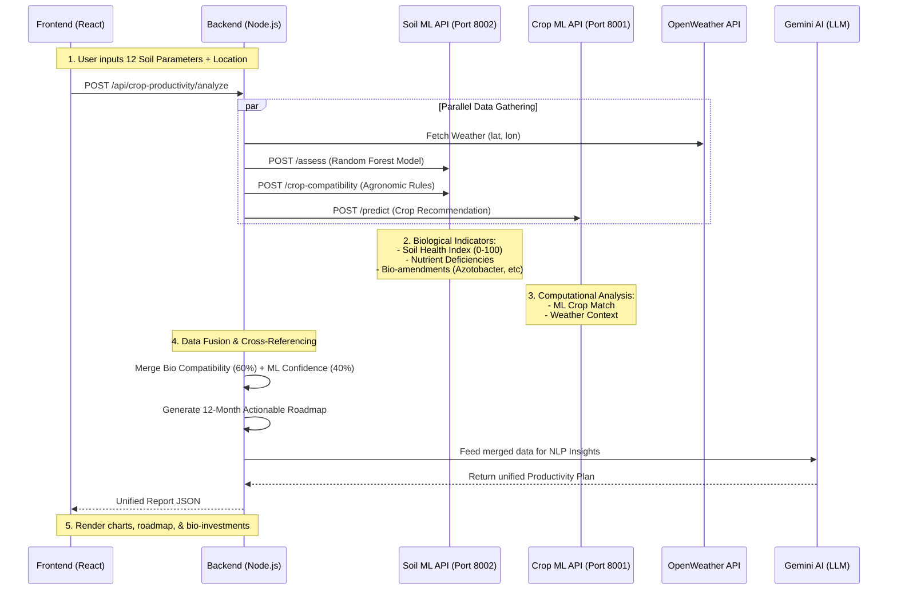

# Soil Health & Crop Productivity Architecture

I have updated your backend to directly use the machine learning model from your cloned repository (`Soil-Quality-Fertility-Prediction-main/random_forest_pkl.pkl`).

Here is exactly how the software connects **Soil Health Assessment** (biological indicators) with **Crop Productivity Optimization** (computational analysis) in your project.

## System Architecture

## How It Works (Pure Software Perspective)

### 1. The Machine Learning Layer (`soil_health_api.py`)
Your integrated Python API uses the Random Forest model (`random_forest_pkl.pkl`) from the `Soil-Quality-Fertility-Prediction-main` repository. 
- It takes 12 numerical vectors (N, P, K, pH, etc.) and predicts a **Fertility Class** (Less Fertile, Fertile, Highly Fertile).
- It computationally analyzes nutrient gaps by comparing the input vector against a hardcoded biological database of optimal ranges.
- It dynamically assigns **Biological Indicators** (e.g., prescribing *Azotobacter* for low Nitrogen or *Trichoderma* for low organic carbon).

### 2. The Orchestration Layer (`cropProductivityController.ts`)
The Node.js backend acts as the brain, fusing different computational models:
- **Cross-Referencing**: It takes the crops suggested by the biological compatibility check (`/crop-compatibility`) and cross-references them with the crops suggested by the weather-aware ML model (`/predict`).
- **Scoring**: It calculates a `combined_score` weighing the physiological compatibility (60%) against the probabilistic ML confidence (40%).

### 3. The Optimization Output (The 12-Month Roadmap)
The software doesn't just stop at prediction. The `buildProductivityRoadmap` function programmatically schedules the biological recommendations into a timeline.
- **Month 1 (Preparation)**: Automatically injects the bio-recommendations (e.g., "Apply VAM 5-10 kg/acre") outputted by the Soil ML API.
- **Month 2-12**: Schedules sowing, top-dressing, and harvesting based on the optimal crop selected during the cross-referencing phase.

### 4. Generative AI Synthesis
Finally, the raw JSON data (fertility class, top crops, biological inputs, weather) is structured into a prompt and sent to Gemini. Gemini translates the hard data into a human-readable "Executive Summary" and "ROI Investment Advice", turning raw computational analysis into a premium, user-friendly software feature.
